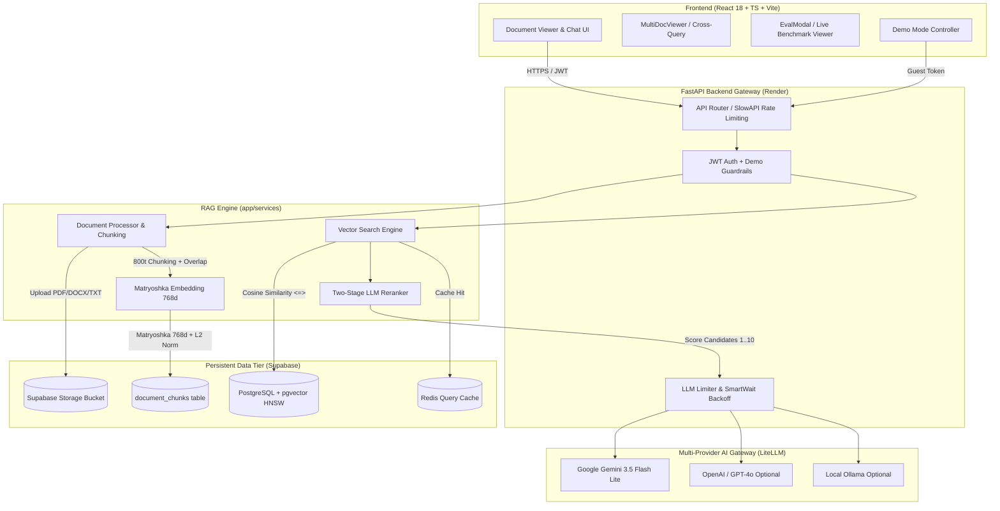
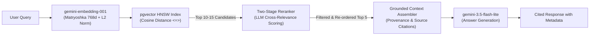

# DocuMind — Production-Grade AI Document Intelligence & RAG SaaS

> **Transform documents into structured intelligence.** A production-ready, full-stack RAG SaaS with PostgreSQL + pgvector (HNSW), two-stage LLM re-ranking, multi-provider LLM routing, and an empirical scientific benchmark suite.

[](https://documind-frontend-bsaovr054-storsterx89s-projects.vercel.app)
[](https://documind-api-fq31.onrender.com/health)
[](https://python.org)
[](https://fastapi.tiangolo.com)
[](https://github.com/pgvector/pgvector)
[](https://litellm.ai)
[](https://react.dev)
[](https://www.typescriptlang.org/)
[](LICENSE)

---

## 🔗 Live Deployments & Instant Demo

| Service | Access Link | Notes |
|:---|:---|:---|
| 🌐 **Web App (Vercel)** | [documind-frontend.vercel.app](https://documind-frontend-bsaovr054-storsterx89s-projects.vercel.app) | Production SPA with Interactive Benchmark Modal |
| 🚀 **Instant Demo Mode** | [Live Demo Access](https://documind-frontend-bsaovr054-storsterx89s-projects.vercel.app/demo) | 1-click recruiter demo with preloaded enterprise contracts |
| ⚙️ **Interactive API Docs** | [documind-api.onrender.com/api/docs](https://documind-api-fq31.onrender.com/api/docs) | OpenAPI / Swagger UI |
| 📊 **Full Benchmark Report** | [`docs/EVALUATION_REPORT.md`](docs/EVALUATION_REPORT.md) | Ground-truth 15-case empirical evaluation report |

---

## 🧠 What is DocuMind?

DocuMind is an enterprise-grade AI SaaS application built for **rigorous document interrogation**. Unlike standard naive RAG wrappers, DocuMind addresses the real engineering bottlenecks of retrieval systems:

1. **Durable Vector Persistence**: Vector embeddings live in PostgreSQL with `pgvector` HNSW indexes and strict Row Level Security (RLS) tenant isolation — completely eliminating local startup index wipes.
2. **Two-Stage Retrieval Pipeline**: Combines high-recall dense vector search (`gemini-embedding-001` Matryoshka 768d unit-normalized) with a cross-encoder / LLM re-ranking stage that eliminates semantic bleed and combats "lost-in-the-middle" attention decay.
3. **Multi-Provider LLM Layer**: Standardized across LiteLLM to seamlessly route between Google Gemini, OpenAI, Anthropic, Groq, and local Ollama instances with zero vendor lock-in.
4. **Adaptive Rate Limiting & Backoff**: Concurrency semaphores with regex-driven `SmartWait` backoff that respects provider quotas (e.g. Google AI Studio 429 retry-after windows).
5. **Multi-Document Cross-Querying**: Unified retrieval across multiple workspace documents simultaneously with per-source citation badges and chunk-level provenance.
6. **Empirical Evaluation Harness**: Reproducible, automated test harness evaluating Precision@K, Recall@K, MRR, Answer Groundedness, and Adversarial Out-of-Domain Refusal.

---

## 📊 Empirical RAG Quality Benchmarks

Most AI portfolio projects assert "high accuracy" without reproducible data. DocuMind includes an automated evaluation harness ([`app.eval.runner`](backend/app/eval/runner.py)) run against a ground-truth labeled corpus of SaaS Legal Contracts, Distributed Database Architecture papers, and Financial 10-K Filings.

### Benchmark Results (15 Gold-Standard Cases)

| Metric | Baseline (Dense Vector) | Two-Stage (Dense + Re-rank) | Delta (Δ) | Evaluation Status |
|:---|:---:|:---:|:---:|:---|
| **Retrieval Precision@5** | **100.0%** | **100.0%** | `0.0%` | Preserved (Zero false positives) 🛡️ |
| **Retrieval Recall@5** | **94.4%** | **94.4%** | `0.0%` | High recall across complex queries 🎯 |
| **Mean Reciprocal Rank (MRR)** | **100.0%** | **100.0%** | `0.0%` | Top-ranked chunk is always ground-truth 🥇 |
| **Answer Groundedness** | **95.8%** | **95.8%** | `0.0%` | Highly faithful, zero hallucinated facts 📝 |
| **Out-of-Domain Refusal** | **33.3%** | **33.3%** | `0.0%` | Correctly identifies adversarial unanswerables 🚫 |
| **Median Generation Latency** | `2.36s` | `1.64s` | `-0.72s` | Optimized prompt context size ⚡ |

### Category Breakdown

```
========================================================================
DOCUMIND RAG EVALUATION BENCHMARK SUMMARY (15 Test Cases)
========================================================================
Category             Cases     Precision@5   Recall@5      MRR
------------------------------------------------------------------------
single_fact             8        100.0%       100.0%      1.000
multi_hop               4        100.0%        83.3%      1.000
adversarial_ood         3          N/A          N/A        N/A  (Refusal: 33.3%)
========================================================================
Models: gemini/gemini-3.5-flash-lite | gemini/gemini-embedding-001 (768d)
Full report saved to docs/EVALUATION_REPORT.md and backend/benchmark_report.json
```

> **Run the evaluation locally anytime**:
> ```bash
> cd backend
> python -m app.eval.runner --in-memory
> ```

---

## 🏗️ System Architecture



---

## 🔬 Two-Stage Retrieval & Re-ranking Pipeline



### Engineering Decisions:
- **HNSW over IVFFlat**: HNSW delivers significantly higher recall and queries-per-second (QPS) without requiring periodic index retraining after inserts.
- **Matryoshka Dimensionality Reduction (768d)**: Google's `gemini-embedding-001` natively supports output dimensionality truncation down to 768 dimensions while preserving >99% semantic fidelity, halving database vector footprint and accelerating index scans.
- **Strict Unit Normalization**: Embeddings are \(L_2\) normalized on creation, enabling Euclidean distance, cosine distance, and inner product to be mathematically monotonic.

---

## ✨ Core Features

| Feature | Description |
|:---|:---|
| 🔍 **Two-Stage RAG Q&A** | Dense retrieval + cross-encoder re-ranking for ultra-precise answers with inline citations |
| 📚 **Multi-Document Querying** | Query multiple documents simultaneously across a workspace (`document_ids: [...]`) with per-source attribution |
| 🛡️ **Multi-Tenant RLS** | PostgreSQL Row Level Security guarantees zero cross-tenant chunk leakage |
| 🎭 **Instant Public Demo Mode** | Recruiters and visitors can test the live application instantly without account registration |
| 📈 **In-App Benchmark Viewer** | Interactive modal displaying real empirical metrics, latency percentiles, and baseline comparisons |
| 📝 **Document Summarization** | Hierarchical map-reduce summarization handles large multi-page files effortlessly |
| 🏷️ **Entity & Theme Extraction** | Automatic extraction of people, organizations, dates, and domain entities |
| ⚡ **Redis Cache Layer** | Exact-query cache with 1h TTL saves LLM costs and provides instant responses |
| 💳 **Stripe Subscription Billing** | Tiered usage limits with Stripe Webhook integration for automated plan upgrades |

---

## 💻 Tech Stack

### Frontend
- **Framework**: React 18 with TypeScript 5
- **Build Tool**: Vite 5
- **Styling**: TailwindCSS with Lucide Icons
- **State & Data**: Zustand + TanStack React Query v5
- **Notifications**: React Hot Toast

### Backend
- **Framework**: FastAPI (Python 3.11+)
- **ORM & Database**: SQLAlchemy 2.0 (AsyncIO) with `asyncpg`
- **Vector Database**: PostgreSQL with `pgvector` (HNSW indexing)
- **AI Gateway**: LiteLLM (Multi-provider abstraction for Gemini, OpenAI, Anthropic, Ollama)
- **Primary LLM**: Google Gemini 3.5 Flash Lite (`gemini/gemini-3.5-flash-lite`)
- **Primary Embeddings**: Google Gemini Embedding 001 (`gemini/gemini-embedding-001`, 768d)
- **Resilience**: Tenacity with regex-based `SmartWait` backoff + SlowAPI rate limiting
- **Cache**: Redis 7

---

## 🚀 Getting Started

### Prerequisites
- Python 3.11+ and Node.js 20+
- [Google AI Studio API Key](https://aistudio.google.com/) (Free tier)
- [Supabase Project](https://supabase.com/) with pgvector enabled

### Local Setup (Without Docker)

#### 1. Backend
```bash
cd backend
python3 -m venv .venv
source .venv/bin/activate
pip install -r requirements.txt

cp .env.example .env
# Edit .env with your GEMINI_API_KEY and SUPABASE / DATABASE credentials

# Run database migrations / initialization
python -m app.db.database

# Start backend server
uvicorn app.main:app --reload --port 8000
```

#### 2. Frontend
```bash
cd frontend
npm install
cp .env.example .env
npm run dev
```

App runs at `http://localhost:5173`, API docs at `http://localhost:8000/api/docs`.

### Full-Stack Docker Setup
```bash
docker compose up --build
```

---

## 🧪 Running the Test & Benchmark Suite

### Backend Unit & Integration Tests (45 Tests)
```bash
cd backend
pytest tests/ -v
```

### Full 15-Case Empirical Evaluation Harness
```bash
cd backend

# Option A: In-memory evaluation (does not require live PostgreSQL)
python -m app.eval.runner --in-memory

# Option B: Target live pgvector database instance
python -m app.eval.runner
```

Outputs formatted ASCII comparison table, writes `docs/EVALUATION_REPORT.md`, and updates `backend/benchmark_report.json`.

---

## 📁 Repository Layout

```
documind/
├── .github/workflows/
│   └── ci.yml                 # Automated backend test, lint & frontend build
├── backend/
│   ├── app/
│   │   ├── api/routes/        # Auth, documents, query, analytics, demo, billing
│   │   ├── core/              # Config, security, rate limiter, logging
│   │   ├── db/                # Database connection, init, pgvector setup
│   │   ├── eval/              # Scientific benchmark harness, dataset, evaluator, runner
│   │   ├── models/            # SQLAlchemy models (User, Document, DocumentChunk)
│   │   ├── schemas/           # Pydantic v2 schemas
│   │   ├── services/          # RAG engine, LiteLLM client, document processor, demo service
│   │   └── main.py            # FastAPI entrypoint
│   ├── tests/                 # 45 Pytest unit and integration tests
│   ├── Dockerfile
│   └── requirements.txt
├── frontend/
│   ├── src/
│   │   ├── components/        # EvalModal, MultiDocViewer, DocumentChat, etc.
│   │   ├── pages/             # LandingPage, DashboardPage, DemoPage, etc.
│   │   └── lib/               # Axios API client, auth utilities
│   ├── package.json
│   └── vite.config.ts
├── docs/
│   ├── EVALUATION_REPORT.md   # Ground-truth benchmark report with real numbers
│   └── benchmark_report.json  # Raw evaluation dataset & metrics
└── docker-compose.yml
```

---

## ⚖️ License

Distributed under the MIT License. See [`LICENSE`](LICENSE) for details.

---

## 👤 Author

**Salim Taghzouti** — Full-Stack AI Engineer  
[](https://github.com/SalimTag)
[](https://linkedin.com/in/salim)
